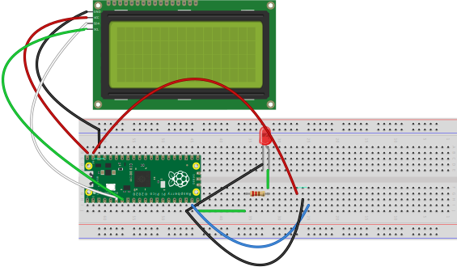
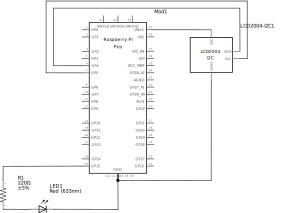

# firmware

The code running on the Raspberry Pi Pico.

---

## Schematics





This program will output "this is a test" and "line2" to the LCD, and then flash the onboard LED.

## Building

### Docker

If you have podman:

```bash
mkdir /tmp/out
podman build -t firmware-builder .
podman run -t --rm  -v /tmp/out:/out:Z -v ${PWD}:/src:Z firmware-builder
```

If you have docker:

```bash
mkdir /tmp/out
docker build -t firmware-builder .
docker run -t --rm  -v /tmp/out:/out:Z -v ${PWD}:/src:Z firmware-builder
```

This will create a file named `/tmp/out/firmware.uf2`, which can be flashed to the pico.

### Manually

You'll have to install the pico sdk, rust tools, the correct toolchain and corrosion. It'll probably be best to read the Dockerfile and the buildscript (build.sh) for more information on how to do it.

## License

MIT
